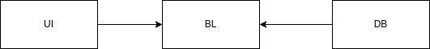

Примечание: данная версия проекта старая, рекомендую смотреть здесь только ЛР 1, 2 и 5 (их нет в новой версии).

[Курсач по БД](https://github.com/XuTpoKoT/bmstu-sem6-db-cp)

Обновлённую версию проекта можно посмотреть [тут](https://github.com/XuTpoKoT/music-shop).
# Магазин музыкальных инструментов

## Описание идеи проекта
Разработка приложения для автоматизации работы музыкального магазина.

## Описание предметной области
Предметной областью являются музыкальные инструменты: гитары и синтезаторы.

## Анализ аналогичных решений по 3 критериям 
| Критерий             |      Музторг    | DYNATONE  |7 Нот |
| :------------------: |:-------------:|:-----:|:-----:|
| ассортимент          | + | - |+|
| программа лояльности | + | + |+|
| доставка             | + | + |-|

## Use-Case - диаграмма

## ER-диаграмма сущностей

## Пользовательские сценарии (в текстовом виде)
### Неавторизованный пользователь
* Войти/зарегистрироваться. Для этого нужно ввести логин и пароль.
* Посмотреть информацию о конкретном товаре
### Клиент
* Выйти
* Посмотреть личные данные
* Добавить товар в корзину
* Перейти в корзину. После перехода в корзину клиент может удалять товары из корзины, выбрать точку доставки или нажать на кнопку сделать заказ.
* Посмотреть историю заказов
### Сотрудник
* Выйти
* Посмотреть личные данные
* Добавить товар в корзину
* Перейти в корзину. После перехода в корзину сотрудник может удалять товары из корзины, выбрать точку доставки или нажать на кнопку оформить продажу.
* Посмотреть историю продаж
## Формализация бизнес-правил (в виде BPMN)
* Регистрация

* Оформление заказа

## Описание типа приложения и выбранного технологического стека
### Тип приложения
 Web MPA
### Технологический стек:
1. Backend: Java, Spring Framework (Core, Security, MVC, Boot), Thymeleaf
2. СУБД: PostgreSQL

## Верхнеуровневое разбиение на компоненты

